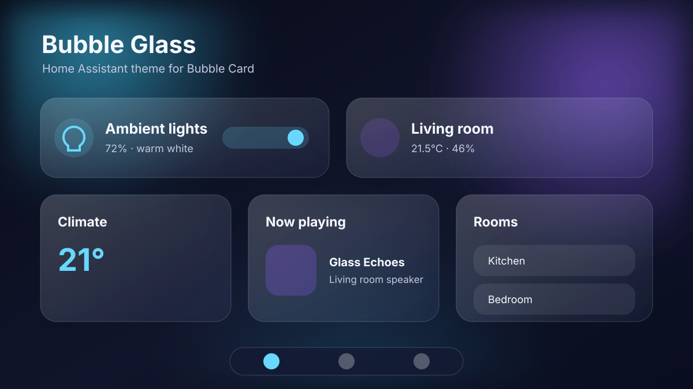

# Bubble Glass

A glass theme for Home Assistant with first-class [Bubble Card](https://github.com/Clooos/Bubble-Card) styling. One theme follows Home Assistant's light or dark mode and keeps the same cyan and violet identity in both.

[](https://my.home-assistant.io/redirect/hacs_repository/?owner=benkl&repository=bubble-glass&category=theme)



## What it changes

- Translucent Home Assistant cards, dialogs, app header, and sidebar
- Matching Bubble Card buttons, sliders, media players, covers, selects, climate cards, pop-ups, and footer
- Light and dark modes in one `Bubble Glass` theme
- CSS gradient background with no image download or external runtime dependency
- Semantic active, success, warning, error, climate, lock, and alarm colors
- Reduced-motion support

Bubble Card uses its documented theme variables. The theme does not depend on Bubble Card's private selectors, so routine Bubble Card updates are less likely to break it.

## Requirements

- Home Assistant with YAML themes enabled
- [Bubble Card](https://github.com/Clooos/Bubble-Card) 3.4.1 or newer recommended
- [card-mod](https://github.com/thomasloven/lovelace-card-mod) recommended for real blur on standard Home Assistant cards and the app header

Bubble Card 3.2.0 or newer is enough for the standalone pop-up format used in the example. The theme still loads without Bubble Card or card-mod. Without card-mod, Home Assistant keeps the palette and translucent backgrounds but loses backdrop blur on standard cards. Dialog tinting comes from Home Assistant's own dialog theme variables and works without card-mod.

## Install with HACS

Add this repository to HACS as a custom repository (category **Theme**): `https://github.com/benkl/bubble-glass`

1. Open HACS.
2. Open the three-dot menu and select **Custom repositories**.
3. Enter this repository's GitHub URL.
4. Select **Theme** as the category and add it.
5. Open **Bubble Glass** in HACS and select **Download**.
6. Install Bubble Card from HACS under **Frontend**.
7. Install card-mod from HACS under **Frontend** if you want full backdrop blur.

Enable theme discovery in `configuration.yaml`:

```yaml
frontend:
  themes: !include_dir_merge_named themes
```

Restart Home Assistant once after adding that setting. For later theme updates, run the `frontend.reload_themes` action from **Developer tools > Actions**.

Open your profile, choose **Bubble Glass**, and leave theme mode on **Auto** to follow the device light or dark setting.

## Manual install

1. Copy [`themes/bubble-glass.yaml`](themes/bubble-glass.yaml) to `<config>/themes/bubble-glass/bubble-glass.yaml`.
2. Add the `frontend` configuration shown above.
3. Restart Home Assistant, or run `frontend.reload_themes` if theme discovery was already enabled.
4. Select **Bubble Glass** from your profile.

## Bubble Card setup

The theme styles Bubble Card globally. Individual cards need no `styles:` block.

A minimal glass button:

```yaml
type: custom:bubble-card
card_type: button
button_type: slider
entity: light.living_room
name: Living room
icon: mdi:sofa
use_accent_color: true
```

A themed standalone pop-up:

```yaml
type: custom:bubble-card
card_type: pop-up
hash: "#kitchen"
name: Kitchen
icon: mdi:silverware-fork-knife
popup_mode: adaptive-dialog
bg_opacity: "82"
bg_blur: "28"
shadow_opacity: "25"
cards:
  - type: custom:bubble-card
    card_type: button
    button_type: slider
    entity: light.kitchen
    name: Kitchen lights
```

See [`examples/bubble-card-dashboard.yaml`](examples/bubble-card-dashboard.yaml) for buttons, climate, media player, select, pop-up, sub-buttons, and the horizontal footer.

## Glass module (recommended)

Bubble Card exposes color, border, radius, and shadow variables, but no backdrop-filter variable, and the bottom menu buttons have no background of their own. The global module in [`examples/bubble-glass-module.yaml`](examples/bubble-glass-module.yaml) closes the gap:

- Real backdrop blur on every Bubble Card row
- A pinned, blurred glass slab behind the bottom menu. The bar is fixed, so dashboard content scrolling underneath smears through it, which is what sells the glass
- Glass-chip buttons in the bottom menu: translucent tint, one clean edge, inset highlight. The chip uses `border-radius: inherit`, so it can never fight the button's radius, and Bubble Card's active highlight still fills on top

Install: copy the file to `<config>/bubble-modules.yaml` (merge it if that file already exists), or recreate it in any card under **Modules > Create new module** and toggle **All cards**. It reads the theme's `--glass-*` tokens, so it follows light and dark mode on its own.

The module targets Bubble Card CSS classes, so recheck it after major Bubble Card updates. Skip it on low-power wall panels; the base theme works without it.

## Customization

Edit `themes/bubble-glass.yaml`, then run `frontend.reload_themes`.

The main controls are repeated under each mode:

| Variable | Purpose |
| --- | --- |
| `lovelace-background` | Gradient behind all glass surfaces |
| `glass-background` | Standard card tint |
| `glass-backdrop-filter` | Standard card blur and saturation |
| `glass-border-color` | Glass edge |
| `glass-shadow` | Ambient card shadow |
| `bubble-main-background-color` | Main Bubble Card tint |
| `bubble-secondary-background-color` | Icons, controls, and nested layers |
| `bubble-accent-color` | Active Bubble Card color |
| `bubble-border` | Bubble Card glass edge |
| `bubble-box-shadow` | Bubble Card depth |
| `bubble-pop-up-background-color` | Bubble Card pop-up shell |

### Low-power wall panels

Backdrop blur can lag on old tablets and low-end GPUs. Disable standard-card blur while keeping transparency, borders, and shadows:

```yaml
glass-backdrop-filter: "none"
app-header-backdrop-filter: "none"
ha-dialog-surface-backdrop-filter: "none"
```

Do not install the optional Bubble Glass blur module on those devices.

### Use a photo background

Replace `lovelace-background` in both modes with a local file:

```yaml
lovelace-background: >-
  center / cover fixed no-repeat url('/local/backgrounds/home.jpg')
```

Store the image at `<config>/www/backgrounds/home.jpg`. A detailed image makes glass blur more obvious, but local files are preferable to remote URLs because the dashboard still works offline.

## HACS publishing checklist

The repository files are ready for HACS custom-repository installation. Before requesting inclusion in the default catalog:

1. Push the repository to public GitHub.
2. Add a short GitHub description.
3. Add topics such as `home-assistant`, `home-assistant-theme`, `hacs`, `bubble-card`, and `glassmorphism`.
4. Enable GitHub Issues.
5. Replace or supplement the SVG preview with screenshots from a real Home Assistant instance.
6. Confirm the **Validate** workflow passes.
7. Publish a GitHub release. A release is required for default-catalog submission; a bare tag is not enough.
8. Submit the repository to the `theme` list in [hacs/default](https://github.com/hacs/default).

Custom-repository users can install from the default branch without a release.

## Research and design notes

The source review, variable inventory, decisions, risks, and packaging plan are in [`docs/research-and-plan.md`](docs/research-and-plan.md).

## Credits and license

Bubble Glass is derived from Clooos's [Bubble theme](https://github.com/Clooos/Bubble), which was based on aFFekopp's Noctis theme. Distributed under the [MIT License](LICENSE).
